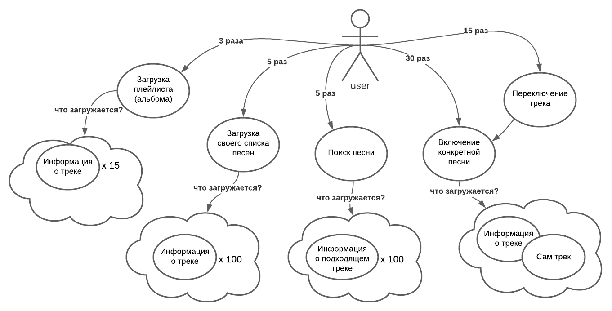
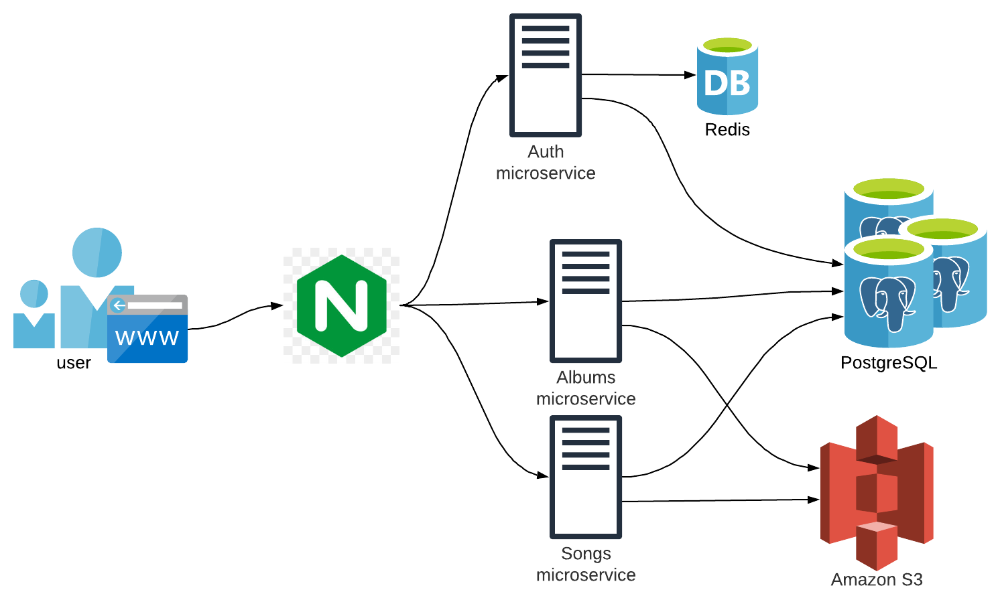

# Boom (VK music)
Course work on Highload: system design of Boom - service for listening to music.

---
## Тема и целевая аудитория
### Тема курсовой: 
Boom - сервис для прослушивания музыки.  
Аналоги: Spotify, Яндекс Музыка, Apple Music, Deezer.  

###Целевая аудитория: 
В июле 2020 года число подписчиков Boom 3.5 миллиона подписчиков[1].  
Пользователи находятся в России.

---
## Расчет нагрузки
### Продуктовые метрики
· Месячная аудитория больше количества подписчиков сервиса. Официально данная статистика не опубликована, но возьмем ее равной **7 миллионам**.
Вероятно, пользователи слушают музыку не каждый день.  
· В качестве дневной аудитории возьмем **2 миллиона**, опираясь также на показатели Яндекс музыки[2].  

### Технические метрики
 
Средняя длительность одного трека - 3 минуты, минута песни весит в среднем 2МБ[3].
#### RPS                                                
Допустим, MVP:                                                  
- Загрузка своей страницы с песнями;
- Включение конкретной песни из списка;
- Переключение песни;
- Поиск новых песен.  

Тогда каждый пользователь в день в среднем 5 раз открывает главный список (100 песен), 
3 раза открывает конкретный плейлист(альбом), слушает 90 минут песни(90/3 = ~30 песен), 15 раз за это время нажимает на переключение песни,
и, допустим, 5 раз ищет песни по названию. Также после открытия главного списка песен пользователь 2 раза пролистывает его до конца, чтобы подгрузились новые треки.  
То есть от всех пользователей получается  
- 5 * 2.000.000 = 10.000.000 запросов в день на открытие списка песен = 115 RPS;  
- 3 * 2.000.000 = 6.000.000 запросов в день на открытие плейлистов = 69 RPS;  
- 2 * 2.000.000 = 4.000.000 запросов в день на пролистываение плейлиста = 46 RPS;  
- 30 * 2.000.000 = 60.000.000 запросов на получение трека = 694 RPS;  
- 15 * 2.000.000 = 30.000.000 запросов на переключение = 347 RPS;  
- 5 * 2.000.000 = 10.000.000 запросов в день на поиск песен = 115 RPS;  

Итого 115 + 69 + 46 + 694 + 347 + 115 = **1386 RPS**, если учитывать только функционал описанного выше MVP.                                                    


### Размер переданных данных в день

#### Клики внутри приложения  

_Информация о песне в плейлисте(маленькая картинка + название): 3 Кб._  
_Информация о конкретной песне(большая картинка + название): 15 Кб_  
_Размер передаваемых музыкальных файлов рассчитаем отдельно в следующем пункте_

- 5 раз загрузка списка песен + 2 пролистывания: 5 * 100 * 3Кб = 1500Кб  
- 3 раза загрузка плейлиста(альбома): 5 * 15 * 3Кб = 1500Кб  
- 5 раз поиск песни: 5 * 100 * 3Кб = 1500Кб
- 30 + 15 раз включение + переключение песни: 45 * 15Кб = 675Кб

Итого 2.000.000 пользователей * (1500+1500+675)Кб = 7350*10^6Кб ≈ 7350Гб = **58800Гбит в день**  
Это ~0.7 Гбит/с

#### Прослушивание музыки
Среднее время прослушивания музыки в день - 90 минут[4]  
В день в сумме через сервис проходит 2.000.000 * 90 = 180.000.000 минут музыкального контента.  
· То есть в день Boom передает: 180.000.000 минут * 2Mb/минута = 360.000.000 Мб = **360Тб**.
Это 360 * 8000 / (24 * 60 * 60) = **33 Гбит/c**

### Итого
| Метрика                |  Значение   | 
|------------------------|:-----------:|
| Месячная аудитория     |    7 млн    |
| Дневная аудитория      |    2 млн    |
| Размер хранилища       |    30 Тб    |
| RPS                    |  1386 RPS   |
| Передача данных        | 33.7 Гбит/с |
---
## Логическая схема БД


---
## Физическая схема БД


### Объем данных
_Количество треков:_  
Официально количество треков в Boom не опубликовано, но проведя аналогию между другими сервисами[5], будем считать музыкальную базу
равной **60млн песен**.    
_Количество плейлистов:_  
Статистика по количеству плейлистов VK музыки неизвестна. Проведем аналогию со Spotify[6]. 
У него ~250млн пользователей и 2 млрд плейлистов. У VK музыки 7млн пользвателей. 
Тогда будем считать количество плейлистов равным (2 * 10^9 / 250 * 10^6) * 7 * 10^6 = **56 млн плейлистов**  
_Количество исполнителей:_  
Количество исполнителей будем считать **1млн**  
_Количество альбомов:_  
Количество альбомов также неизвестна. Будем считать, что у каждого исполнителя в среднем 5 альбомов. Итого 5 * 10^6 = **5млн альбомов**

- Треки  
Как уже говорилось выше, редняя длительность одного трека - 3 минуты, минута песни весит в среднем 2МБ[4].  
То есть размер хранения для треков равен 50.000.000 треков * 3 минуты/трек * 2 Mb/минута = **300Тб**.  
- Картинки  
У каждого трека есть картинка, но у некоторых она повторяется из-за того, что они выпущены рамках одного альбома. 
Из всего количества треков примерно 50млн выпущены в альбомах, 10млн в качетсве синглов. Итого 20млн уникальных картинок.
Каждая картинка хранится в двух размерах - маленькая для отображения в списке писем и большая, для отображения при проигрывании.
Вес маленькой картинки - 2,5Кб, большой - 500Кб. Итого 2.000.00 * (2,5 + 500)Кб = **2Тб**
- Текстовая информация  
**Для треков** мы храним id(4 б), название(15 б), исполнителя(15 б), адрес маленькой картинки(20 б), адрес большой картинки(20 б), адрес трека(20 б), длительность(4 б)   
```Итого 4 + 15 + 15 + 20 + 20 + 20 + 4 = 98 байт на трек```  
**Для плейлистов**: id(4 б), название(15 б), автора(15 б), адрес картинки(20 б), дата последнего обновления(8 б)  
```Итого 4 + 15 + 15 + 20 + 8 = 62 байта на плейлист```  
**Для альбомов**: id(4 б), название(15 б), исполнителя(15 б), адрес логотипа(20 б), дата выпуска(8 б)   
```Итого 4 + 15 + 15 + 20 + 8 = 62 байта на альбом```  
**Для исполнителя**: id(4 б), никнейм(15 б), адрес аватарки(20 б)  
```Итого 4 + 15 + 20 = 39 байт на исполнителя```  
**Для пользователя**: id(4 б), никнейм(15 б), адрес аватарки(20 б), номер телефона(12 б), почту(20 б), пароль(50 б)  
```Итого 4 + 15 + 20 + 12 + 20 + 50 = 121 байт на пользователя```  
Данные вспомогательных таблиц:  
**Трек-альбом**: id альбома(4 б), id трека(4 б)  
```Итого 4 + 4 = 8 байт на строку в таблице```  
**Трек-плейлист**: id плейлиста(4 б), id трека(4 б)  
 ```Итого 4 + 4 = 8 байт на строку в таблице```  

| Таблица       | Размер одной строки | ~Количество строк | Вес таблицы | 
|---------------|:-------------------:|:-----------------:|:-----------:|
| Трек          |       98 байт       |    50.000.000     |    37Гб     | 
| Плейлист      |      62 байта       |    56.000.000     |    26Гб     | 
| Альбом        |      62 байта       |     5.000.000     |    2.5Гб    | 
| Исполнитель   |       39 байт       |     1.000.000     |    0.3Гб    | 
| Пользователь  |      121 байт       |     7.000.000     |    6.5Гб    | 
| Трек-альбом   |       8 байт        |     5.000.000     |    0.3Гб    | 
| Трек-плейлист |       8 байт        |    56.000.000     |    3.4Гб    | 
(размер числового поля: 4 байта, текстового поля: n по количеству символов, дата-время: 8 байт)

Итого **76Гб текстовой информации**

---
## Выбор технологий
### Бэкенд
Для написания бэкенда используем язык **Golang** за его производительность, удобство и простоту(именно из-за простоты выбран Go, а не C++) в написании кода. 
Помимо этого, в Go просто и удобно устроен параллелизм, а также на нем достаточно просто и быстро пишется микросервисная архитеутура.

### Фронтенд
Для фронтенда выберем самые популярные технологии: HTML, CSS. Для написания скриптов выберем **TypeScript**, а не JavaScript,
за то, что он проще в понимании и в нем проще избегать болезненных багов благодаря статической типизации[7].  
Также будем использовать популярную библиотеку **React** за ее производительность(благодаря работе с Virtual DOM),
простоту и поддержку удобного компонентно-ориентированного подхода к разработке.

### Мобильные приложения
- Для IOS будем использовать **Swift**, как самый популярный язык программирования с хорошей скоростью и большим комьюнити.  
- Для Android используем **Kotlin** также за его популярность, удобство и простоту использования[8].

### База данных
- В качестве основной бд для хранения текстовой информации нужна SQL-база данных, выбор между самыми популярными: MySQL и PostgreSQL.
Выберем **PostgreSQL** за большее количество расширений и соответствие ACID[9].
- Для хранения картинок и аудио используем **Amazon S3**  
- Для хранения сессий необходима Key-value база, выберем **Redis** за высокую производительность, простоту использования и открытый исходный код.

### Балансировщик нагрузки
В качестве балансировщика выберем **Niginx** за его скорость и меньшее потребление памяти(в сравнении с Apache)[10]. 

### Архитектура
Для повышения производительноости будем использовать **микросервисную архитектуру**.
Ее плюсы[11]:
- Высокая отказоустойчивость
- Гибкость
- Простота
- Легкий деплой
- Масштабируемость

**Выделим несколько микросервисов:**
- **Микросервис авторизации**.  
Связанные с авторизацией функции не зависят от других частей приложения, таким образом, их можно вынести в отдельный сервис.
Доступ в Redis будет у этого сервиса, так как только его функции работают с лежащими там сессиями.

Далее для обеспечения более быстрой работы и отказоустойчивости имеет смысл разделить оставшийся функционал на микросервисы,
если это возможно. В нашем проекте мы можем выделить еще два микросервиса:
- **Микросервис треков**  
Сюда будут посупать запросы о загрузке информации о треках, добавлении их в избранное и оценках.
- **Микросервис плейлистов и альбомов**  
Сюда будут идти запросы о создании и загрузке и удалении плейлистов, а также добавлении и удалении песен из них.

### Итоговая схема


## Выбор оборудования

### Расположение дата-центров
Почти все пользователи VK музыки находятся в России. Так что имеет смысл ставить дата-центры только в России. 
Один расположим на западе страны, ближе к крупным городам, каким как Москва, Санкт-Петербург, Казань, Волгоград, Уфа итд.
Второй на востоке - для дальних городов. 

### Сервера

---
## Обеспечение отказоустойчивости

Для обеспечения отказоустойчивости принимаем следующие решения[12]:
- Микросервисная архитектура
- Балансировщик нагрузки
- Master-Slave репликация базы данных
- Разделение базы данных на аналитическую и транзакционную
- Грамотная обработка ошибок в коде, из-за одной ошибки не должно падать все приложение
- Мониторинг. Использование логирования и систем сбора метрик(Prometheus), за которыми мы будем следить с целью обнаружения проблем

---
## Список источников
1. https://ru.wikipedia.org/wiki/
2. https://radar.yandex.ru/yandex?month=2021-07
3. http://abcibc.com/computer-notebook-gadget.php?art=4
4. https://vc.ru/media/96460-chislo-podpischikov-yandeks-muzyki-vyroslo-v-tri-raza-za-poltora-goda-i-dostiglo-3-mln
5. https://re-store.ru/blog/sravneniya/music-services-in-russia/
6. https://ru.wikipedia.org/wiki/Spotify
7. https://habr.com/ru/post/482702/
8. https://kotlinlang.ru/docs/reference/comparison-to-java.html
9. https://mcs.mail.ru/blog/postgresql-ili-mysql-kakaya-iz-etih-relyacionnyh-subd
10. https://wiki.merionet.ru/servernye-resheniya/34/apache-vs-nginx-sravnenie-i-preimushhestva/
11. https://simpleone.ru/blog/primenenie-mikroservisnoj-arhitektury-plyusy-minusy-podvodnye-kamni/
12. https://habr.com/ru/post/118496/

